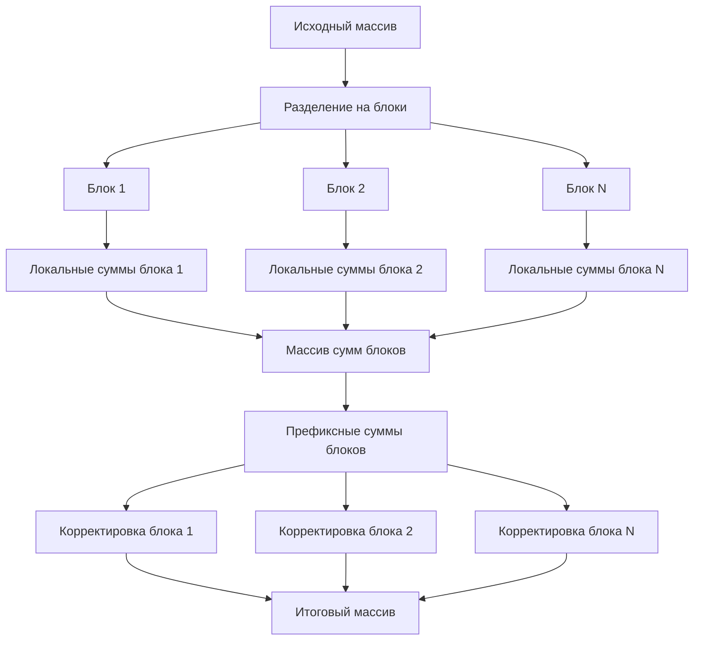

# Параллельное вычисление частичных сумм массива

Данный проект представляет собой реализацию параллельного алгоритма вычисления частичных сумм массива с использованием OpenMP.

## Описание алгоритма

Алгоритм параллельного вычисления частичных сумм состоит из трех основных этапов:

1. **Разделение на блоки и локальное суммирование**
   - Массив разбивается на равные блоки между потоками
   - Каждый поток вычисляет частичные суммы в своём блоке независимо
   - После этого этапа каждый блок содержит корректные локальные частичные суммы

2. **Вычисление сумм блоков**
   - Создается массив с суммами каждого блока
   - Для этого массива вычисляются префиксные суммы
   - Эти суммы будут использоваться как смещения для следующего этапа

3. **Корректировка результатов**
   - Каждый поток добавляет к элементам своего блока сумму всех предыдущих блоков
   - Это обеспечивает правильный учет влияния предыдущих блоков на текущий

### Визуализация алгоритма



## Функциональность программы

Программа включает в себя следующие основные компоненты:

1. **Линейный алгоритм** (`compute_linear_prefix_sum`)
   - Последовательное вычисление частичных сумм
   - Используется как базовый алгоритм для сравнения

2. **Параллельный алгоритм** (`compute_parallel_prefix_sum`)
   - Реализация описанного выше параллельного алгоритма
   - Использует OpenMP для распараллеливания вычислений

3. **Определение эффективного размера M** (`calculate_effectify_parralel_value_M`)
   - Находит минимальный размер массива, при котором параллельный алгоритм эффективнее последовательного
   - Результат сохраняется в файл output.txt

4. **Гибридный алгоритм** (`hybrid_prefix_sum`)
   - Выбирает между последовательным и параллельным алгоритмом на основе размера массива
   - Использует значение M для принятия решения

5. **Построение графиков производительности** (`generate_plot`)
   - Создает графики времени выполнения и ускорения
   - Показывает зависимость от количества потоков

## Запуск программы

Программа поддерживает следующие режимы запуска:

```bash
# Вычисление значения M
task1.exe -task2

# Гибридное вычисление частичных сумм
task1.exe -task3

# Построение графиков производительности
task1.exe -task4
```

## Зависимости

- OpenMP для параллельных вычислений
- Matplot++ для построения графиков
- C++ компилятор с поддержкой C++11 или выше

## Примечания по производительности

- Эффективность параллельного алгоритма зависит от размера входных данных
- При малых размерах массива (M) накладные расходы на создание потоков могут превышать выигрыш от параллелизма, поэтому существует число М
- Оптимальное количество потоков зависит от конкретной системы и размера задачи
