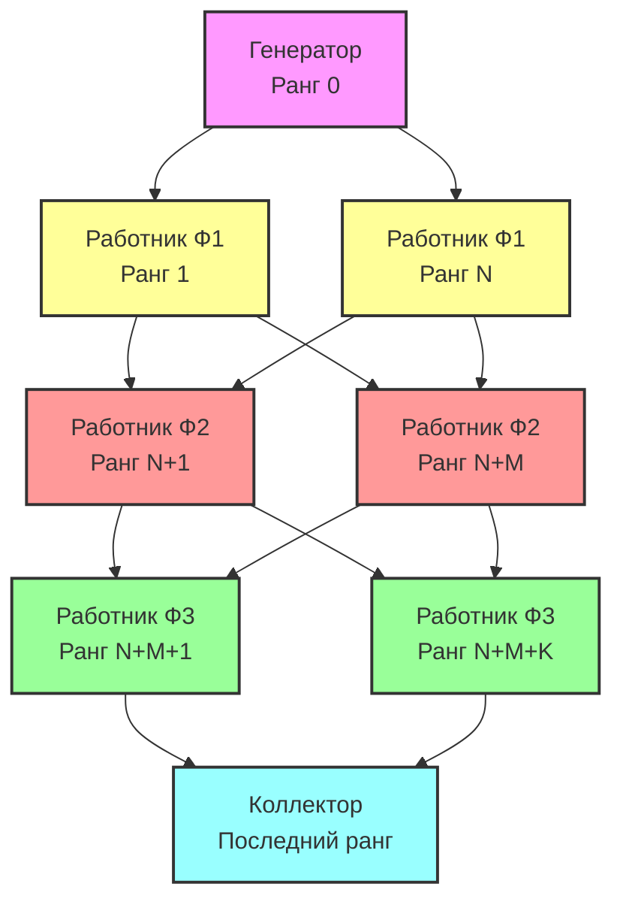

# Параллельный Конвейер с использованием MPI

## Описание
Данный проект реализует параллельный конвейер обработки данных с использованием технологии MPI (Message Passing Interface). Конвейер состоит из нескольких этапов обработки данных, где каждый этап может выполняться на нескольких процессах параллельно.

## Архитектура системы



## Компоненты системы

### 1. Генератор (Ранг 0)
- Создает последовательность чисел для обработки
- Распределяет данные между работниками первого этапа
- Отправляет сигналы завершения работы
- Контролирует начало работы конвейера

### 2. Работники (Ранги 1..N-1)
Выполняют три различные функции обработки данных:

#### Ф1 (Первый этап)
- Увеличивает входное значение на 1
- Имитация задержки: 100 мс
- Пример: input → input + 1

#### Ф2 (Второй этап)
- Возводит число в квадрат
- Имитация задержки: 200 мс
- Пример: input → input * input

#### Ф3 (Третий этап)
- Передает значение без изменений
- Имитация задержки: 150 мс
- Пример: input → input

### 3. Коллектор (Последний ранг)
- Собирает обработанные данные
- Вычисляет итоговую сумму всех значений
- Контролирует завершение работы конвейера
- Выводит финальный результат

## Особенности реализации

### Межпроцессное взаимодействие
- Использует MPI для передачи сообщений между процессами
- Поддерживает динамическое распределение нагрузки
- Обеспечивает синхронизацию между этапами обработки

### Структура сообщений
```cpp
struct DataMessage {
    int value;              // Значение для обработки
    int source;             // Исходный процесс
    bool is_termination;    // Флаг завершения
    double timestamp;       // Временная метка
};
```

### Система логирования
- Каждое действие логируется с временной меткой
- Синхронизированный вывод через мьютекс
- Отслеживание времени выполнения операций
- Форматированный вывод с микросекундной точностью

### Обработка завершения
- Корректное завершение всех процессов
- Обработка сигналов завершения
- Очистка очередей сообщений
- Финальная агрегация результатов

## Конфигурация

Настройка конвейера осуществляется через структуру `PipelineConfig`:
```cpp
struct PipelineConfig {
    std::vector<std::shared_ptr<PipelineFunction>> functions;  // Функции обработки
    std::vector<int> proc_per_func;                           // Процессы на функцию
    bool use_reduction;                                       // Флаг редукции
    int generator_count;                                      // Количество чисел
    int generator_start;                                      // Начальное значение
    int generator_step;                                       // Шаг генерации
};
```

## Производительность
- Параллельная обработка данных
- Балансировка нагрузки между работниками
- Минимизация времени простоя процессов
- Масштабируемость при добавлении новых работников

## Требования
- Компилятор с поддержкой C++11 или выше
- Реализация MPI (например, OpenMPI или MPICH)
- Поддержка многопоточности (std::thread)
- CMake для сборки проекта
