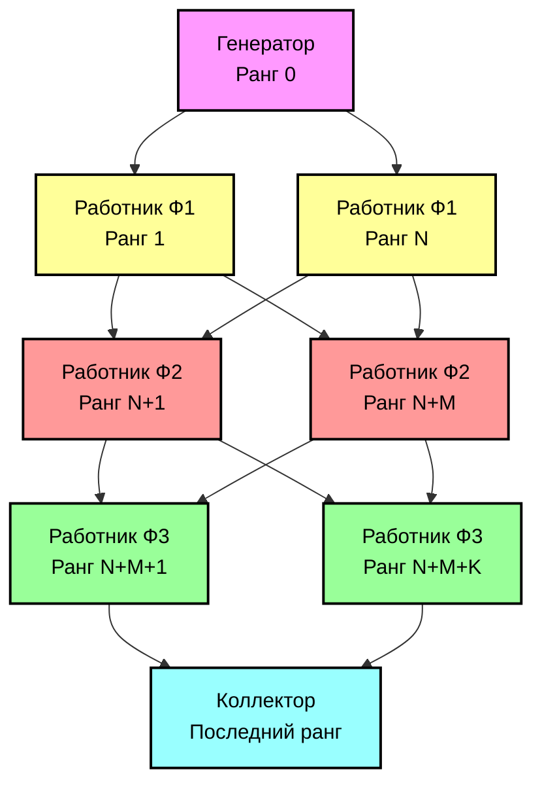

# Параллельный Конвейер с использованием OpenMPI

## Подробное описание архитектуры

### Общая структура


### Инициализация системы

1. **Запуск MPI**
   - Инициализация MPI через `MPI_Init`
   - Определение общего количества процессов и рангов
   - Создание коммуникатора `MPI_COMM_WORLD`

2. **Распределение ролей**
   - Ранг 0: Генератор
   - Ранги 1..N: Работники первой функции (Ф1)
   - Ранги N+1..M: Работники второй функции (Ф2)
   - Ранги M+1..K: Работники третьей функции (Ф3)
   - Последний ранг: Коллектор

3. **Настройка конфигурации**
   ```cpp
   PipelineConfig config;
   config.proc_per_func = {1, 1, 1};  // Количество процессов на функцию
   config.functions = {std::make_shared<F1>(), 
                      std::make_shared<F2>(), 
                      std::make_shared<F3>()};
   ```

### Механизм взаимодействия процессов

1. **Структура сообщений**
   ```cpp
   struct DataMessage {
       int value;              // Обрабатываемое значение
       int source;             // Процесс-отправитель
       bool is_termination;    // Флаг завершения работы
       double timestamp;       // Временная метка
   };
   ```

2. **Протокол обмена данными**
   - **Генератор → Работники Ф1**:
     * Создает последовательность чисел
     * Распределяет данные между работниками по принципу Round-Robin
     * Отправляет сообщения через `MPI_Send` с тегом `DATA_TAG`
     * После отправки всех данных посылает сигналы завершения

   - **Работники → Работники**:
     * Получают данные через `MPI_Recv`
     * Обрабатывают значение согласно своей функции
     * Выбирают следующего работника по формуле:
       ```cpp
       next_rank = rank_ranges[stage + 1].first + 
           (processed_count % (rank_ranges[stage + 1].second - 
           rank_ranges[stage + 1].first + 1));
       ```
     * Отправляют результат следующему этапу

   - **Работники → Коллектор**:
     * Последний этап работников отправляет результаты коллектору
     * Коллектор получает и суммирует значения
     * Отслеживает количество полученных сообщений

3. **Синхронизация и завершение**
   - Каждый процесс ведет учет обработанных сообщений
   - Сигналы завершения передаются каскадно через все этапы
   - Коллектор ждет сигналы завершения от всех работников последнего этапа

### Обработка данных

1. **Функция Ф1 (Инкремент)**
   ```cpp
   int process(int input) override {
       std::this_thread::sleep_for(std::chrono::milliseconds(100));
       return input + 1;
   }
   ```

2. **Функция Ф2 (Возведение в квадрат)**
   ```cpp
   int process(int input) override {
       std::this_thread::sleep_for(std::chrono::milliseconds(200));
       return input * input;
   }
   ```

3. **Функция Ф3 (Идентичность)**
   ```cpp
   int process(int input) override {
       std::this_thread::sleep_for(std::chrono::milliseconds(150));
       return input;
   }
   ```

### Система логирования

1. **Временные метки**
   - Использование `MPI_Wtime` для точного измерения времени
   - Форматирование с микросекундной точностью

2. **Синхронизация вывода**
   ```cpp
   std::mutex cout_mutex;
   template<typename T>
   void safe_cout(T message) {
       std::lock_guard<std::mutex> lock(cout_mutex);
       std::cout << "[" << get_formatted_time() << "] " << message << std::endl;
   }
   ```

### Обработка ошибок и завершение работы

1. **Обработка исключений**
   - Перехват и логирование ошибок в каждом процессе
   - Корректное завершение MPI при возникновении ошибок

2. **Завершение работы**
   - Каскадная передача сигналов завершения
   - Очистка ресурсов и буферов сообщений
   - Корректное завершение MPI через `MPI_Finalize`

## Требования
- Компилятор с поддержкой C++17 или выше
- Реализация MPI (OpenMPI)
- Поддержка многопоточности (std::thread)
