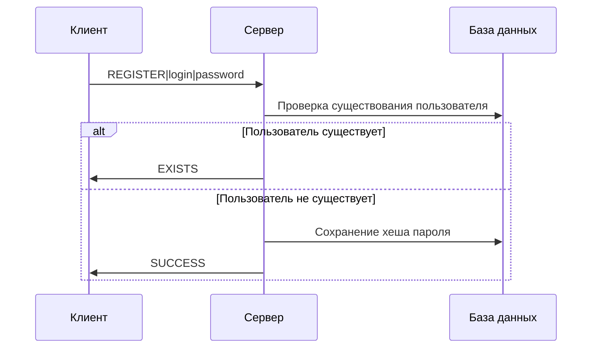
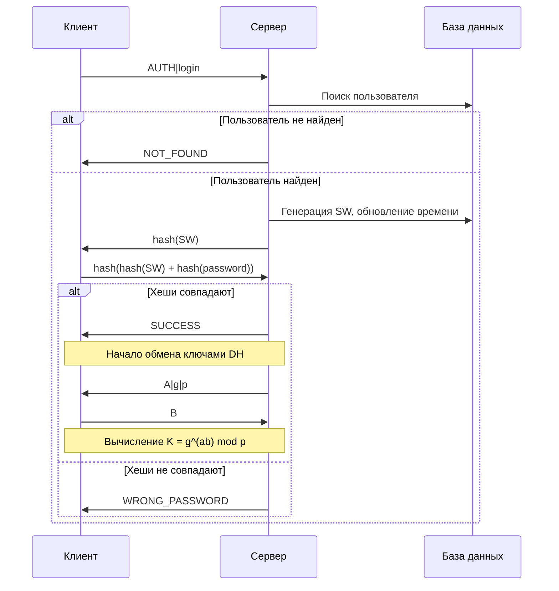
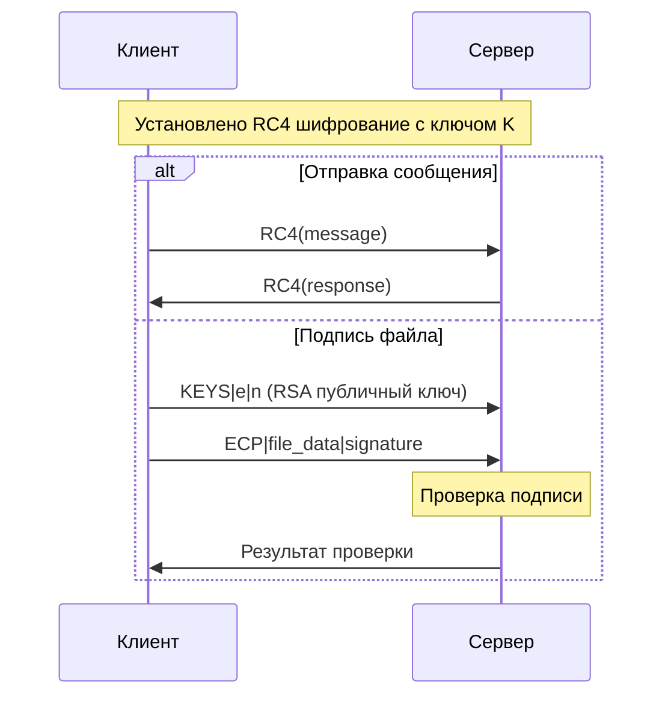

# Защищенный чат

Приложение для защищенного обмена сообщениями с поддержкой шифрования, цифровой подписи и аутентификации.

## Архитектура

Приложение построено на клиент-серверной архитектуре с использованием следующих компонентов:

- **GUI**: PyQt5 для создания графического интерфейса
- **Криптография**: 
  - RC4 для потокового шифрования сообщений
  - RSA для цифровой подписи файлов
  - Диффи-Хеллман для обмена ключами
  - MD5 для хеширования паролей
- **База данных**: SQLite для хранения пользователей
- **Сеть**: TCP сокеты для обмена данными

## Диаграммы процессов

### Регистрация



### Аутентификация



### Обмен сообщениями и файлами



## Структура проекта

```
lab4/
├── main.py                 # Главное окно приложения
├── c_client/              # Клиентская часть
│   └── main.py            # Реализация клиента
├── s_client/              # Серверная часть
│   └── main.py            # Реализация сервера
└── utils/                 # Вспомогательные модули
    ├── __init__.py        # Инициализация пакета
    ├── crypto.py          # Криптографические алгоритмы
    ├── database.py        # Работа с БД
    ├── helpers.py         # Вспомогательные функции
    └── logger.py          # Система логирования
```

## Основные компоненты

### Криптографические алгоритмы (crypto.py)
- **RC4**: Потоковое шифрование сообщений
- **RSA**: Генерация ключей и цифровая подпись

### База данных (database.py)
- Хранение пользователей и их данных
- Управление сессиями и SW значениями

### Вспомогательные функции (helpers.py)
- Генерация криптографических параметров
- Валидация учетных данных
- Хеширование MD5

### Логирование (logger.py)
- Запись действий в файлы логов
- Отслеживание ошибок и событий

## Безопасность

1. **Аутентификация**:
   - Хеширование паролей MD5
   - Механизм SW для защиты от повторных атак
   - Временные метки для контроля сессий

2. **Шифрование**:
   - RC4 для сообщений
   - Протокол Диффи-Хеллмана для обмена ключами
   - RSA для цифровой подписи файлов

3. **Валидация**:
   - Проверка длины и состава логинов/паролей
   - Контроль размера сообщений и файлов
   - Проверка цифровых подписей

## Требования к паролю

- Минимум 5 символов
- Максимум 30 символов
- Только латинские буквы, цифры и символы ?!&
- Минимум одна заглавная буква
- Минимум одна цифра

## Логирование

Система создает отдельные лог-файлы для клиента и сервера:
- client.log - события клиента
- server.log - события сервера
- main.log - общие события приложения

## Запуск приложения

1. Запустите главное приложение:
```bash
python main.py
```

2. В открывшемся окне:
   - Слева - клиентская часть (регистрация/вход)
   - Справа - серверная часть (ожидание подключений)
   - Внизу - просмотр логов и базы данных в реальном времени
